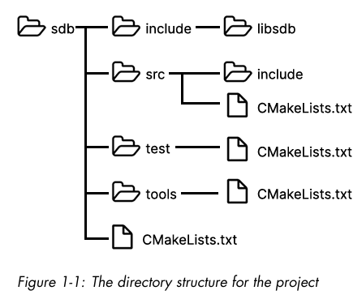
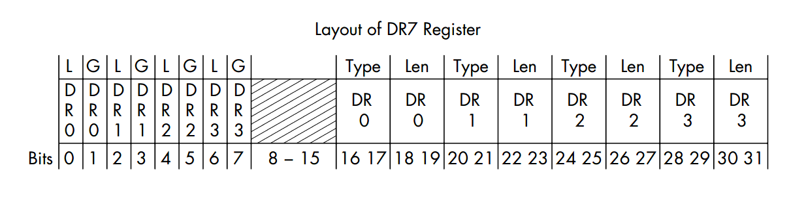
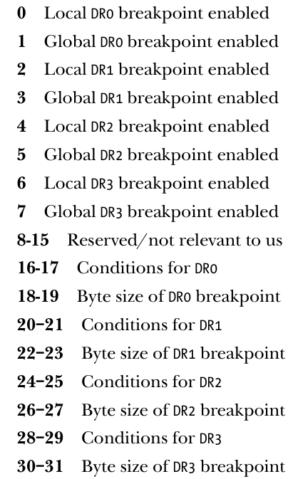
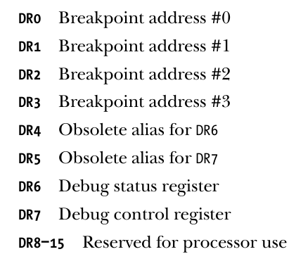

### 项目结构
- 
- libsdb 库的代码，库的核心实现部分，将被拆分到 sdb/include/libsdb 和 sdb/src 目录中。sdb/include/libsdb 文件夹将包含所有公共头文件，供库的使用者与库进行交互。实现部分将位于 sdb/src 中，该目录下包含一个嵌套的 include 文件夹，用于存放任何私有头文件，这些私有头文件不打算提供给最终用户。

#### 第三章部分：启动和附加进程
- 通过运行 sdb <程序名> 启动一个指定的程序并附加到它
- 通过运行 sdb -p <pid> 附加到一个现有的进程。


#### 第四章节：管道、进程和自动化测试
```cpp
std::unique_ptr<sdb::process>
sdb::process::launch(std::filesystem::path path){
    pid_t pid;
    if((pid = fork()) < 0){
        error::send_errno("fork failed");
    }

    if(pid == 0){
        // 将当前的子进程设置成为可以被追踪的形式
        if(ptrace(PTRACE_TRACEME, 0 , nullptr,nullptr) < 0){
            error::send_errno("Tracing failed");
        }
        //用于替换当前进程映像的函数调用
        if(execlp(path.c_str(), path.c_str(), nullptr) < 0){
            error::send_errno("exec failed");
        }
    }
    std::unique_ptr<process> proc (new process(pid, /*terminate_on_end=*/ true));
    proc->wait_on_signal();
    return proc;
}
```

这个代码对于错误的调试文件名来说会出错：因为这里对于execlp情况下，只在子进程中进行了报错，没有在父进程中进行报错处理
解决思路：加入管道机制


遗留问题：第六章中的ptrace部分写入data到寄存器中的时候一直出错 < 0
```
    sdb> c 
    Process 8580 stopped with signal TRAP at 0x6452e97bc146
    sdb> reg write ah 0x42
    ptrace failed: Input/output error
    Could not write to user area: Input/output error
```

#### 硬件调试寄存器部分

- 
- dr7的每个位置说明
- 
- 寄存器的类型
- 

其中从左往右看，例如dr0调试寄存器来说，如果0-1为0b11的话表示dr0已经被使用，只要这两个位置里面有一个1就算在工作
